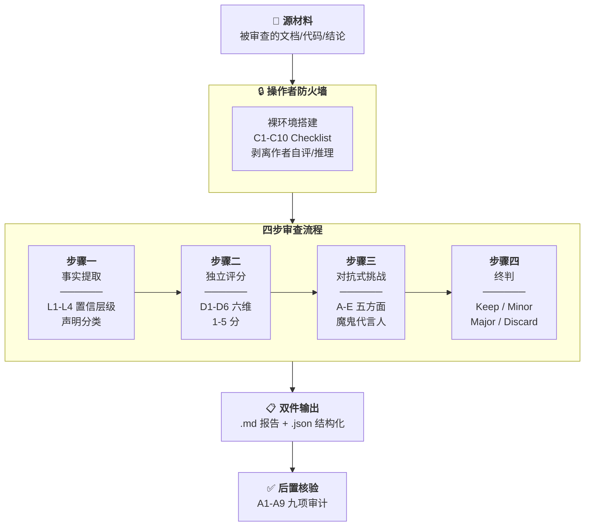

# Independent Review Toolkit · 独立审查工具包

> **English**: A field-tested protocol for multi-model review of AI-generated content. Derived from 50+ review rounds across 5 LLM backends in the [AI Collaboration Framework](https://github.com/redamancy231-create/ai-collaboration-framework) project. Includes a step-by-step SOP, copy-paste prompt templates, adversarial challenge framework, and annotated examples. **CC BY 4.0**.

[]()
[](./en/README.md)
[](./zh-Hant/README.md)

**语言**：简体中文（原文） · [English](en/README.md) · [正體中文](zh-Hant/README.md)  
**来源**：提炼自 [AI协作项目全生命周期框架](https://github.com/redamancy231-create/ai-collaboration-framework) §9.2 + 50+ 轮实战审查  
**成熟度**：SOP 核心流程在源项目中经多后端验证；本工具包自身的提取/改编过程见下方验证状态

> ⚠️ **验证状态**：本仓库 v2.0.1 初版由 **DeepSeek-V4-Pro 单后端**完成提取和改编。已通过 Codex GPT-5.5 异后端独立审查链闭合：
> - **R1**（2026-07-01）：终判 Major，发现 16 项（CRITICAL×3, MAJOR×10, MODERATE×2, MINOR×1）→ 全部修复
> - **R2**（2026-07-01）：终判 **PASS**，16/16 全部闭合 ✅
> 
> 审查报告见 `_reviews/`。工具包方法论（SOP §1-§12）在源项目中经 50+ 轮实战验证；提取/改编/撰写质量经本轮异后端审查确认。

---

## 这是什么

当你用 AI 产出了一份文档/代码/分析结论，你想知道：**"它真的没问题吗？"**

让同一个 AI 检查自己的产出 = 自我审查（不可靠）。找一个**不同后端**的 AI，在**完全隔离**的环境下审查 = 独立审查。

这个工具包提供一套完整的操作协议，让你能在 **5 分钟内启动第一次独立审查**。

### 核心信念

- **独立性 = 不同后端 × 上下文隔离**（缺一不可）
- **评分必须在挑战之前**（先独立判断，再对抗检验）
- **魔鬼代言人不得软化**（审查不是找优点，是找问题）
- **阴性结果和阳性结果同等重要**（"没发现问题"也是有效结论）

---

## 极速版（30 秒开始）

复制下面这段到一个新 AI 会话中，替换 `[材料]` 为你要审查的内容：

```
你是独立审查者。对以下材料进行审查：

1. 列出所有事实性声明，标注置信度（可验证/一致/合理/不可验证）
2. 从逻辑/事实/方法/完整性/清晰度/洞察 6 个维度打分（1-5）
3. 从替代解释/隐藏假设/边界条件/反例/方法论替代 5 个角度找问题
4. 终判：保留/小改/重大修改/弃用 + 理由

材料：[在此粘贴]
```

> 极简版省去了 SOP 的完整约束。正式场景请用 [完整审查 Prompt](prompts/full-review.md)。

---



## 5 分钟上手

### 第一步：理解独立性

独立审查需要两个条件同时满足：
1. **不同后端**：审查者用的 AI 模型 ≠ 产出内容的 AI 模型
2. **上下文隔离**：审查者不能看到作者的中间推理、自评、结论倾向

> ❌ "我用 Claude Code 的另一个 agent 审查" → 同后端，非独立  
> ✅ "我用 ChatGPT 审查 Claude 产出的内容，且开了一个全新会话" → 独立

### 第二步：选一个场景

| 场景 | 用什么 |
|------|--------|
| 审查一份 AI 写的方法论文档 | [完整审查 Prompt](prompts/full-review.md) |
| 只做对抗式挑战（压力测试） | [对抗式挑战 Prompt](prompts/adversarial.md) |
| 想完整理解审查流程 | [完整 SOP](sop.md) |

### 第三步：准备材料，开一个全新会话

**准备阶段**（操作者完成）：
1. 记录**作者后端**（哪个模型产出了被审材料）
2. 记录被审材料的**版本标识**（git commit hash / 文件 hash / 版本号——至少一项）
3. 准备或选用评分标准（可从 [完整审查 Prompt](prompts/full-review.md) 的 D1-D6 六维框架开始；如无特定 rubric，六维框架作为默认标准即可）

**执行阶段**：
1. 开一个**全新会话**（确认无历史上下文泄露）
2. 只粘贴：**prompt + 被审查的材料**（不附带作者自评、中间版本、结论倾向）
3. 不要告诉审查者"这是谁写的""我觉得哪里有问题"
4. 收集结果后，对照 [SOP §10 后置核验](sop.md) 验证审查质量和独立性

---

## 目录结构

```
independent-review-toolkit/
├── README.md                 ← 你在这里
├── LICENSE                   ← CC BY 4.0
├── sop.md                    ← 完整独立审查标准操作程序
├── prompts/
│   ├── full-review.md        ← 完整四步审查 prompt（事实提取→评分→挑战→终判）
│   └── adversarial.md        ← 对抗式挑战专用 prompt（魔鬼代言人模式）
└── examples/                  ← 教学示例（基于真实审查发现重构，非逐字转录）
    ├── methodology-review.md  ← 审查案例演示（含完整 SOP 四步流程 + 注释）
    └── methodology-review.json ← 同案例的结构化 JSON 配套
```

---

## 实战数据

本工具包的方法论来自以下实战积累：

| 指标 | 数据 |
|------|------|
| 审查总轮次 | 50+ |
| 涉及 LLM 后端 | 5 种（GPT-5.5 / DeepSeek-V4-Pro / Kimi-K2.7 / Qwen3.7-Max / GLM-5.2） |
| CLI house | 4 个（Codex / Claude / Kimi / Qwen） |
| 互补性实证 | 同 prompt 多后端 → 盲点互补率 ~50%（三后端实证） |
| 审查衰减实证 | 已识别并内置防衰减约束 |

---

## 与其他工具的关系

| 工具 | 时机 | 焦点 |
|------|------|------|
| **本工具包** | 事后（产出后） | "做得好不好"——完整审查 + 对抗挑战 |
| kill-test-first | 事前（动手前） | "该不该做"——否决式预审 |
| Code Review (自动化) | 事前/事后 | 代码正确性/风格 |

---

## 相关项目

| 项目 | 关系 |
|------|------|
| [**AI协作项目全生命周期框架**](https://github.com/redamancy231-create/ai-collaboration-framework) | **上游来源**——本工具包的 SOP 提炼自框架 §9.2 + 50+ 轮实战审查 |
| [**Prompt-TDD Methodology**](https://github.com/redamancy231-create/prompt-tdd-methodology) | **同级工具**——两个案例实验均使用本工具包的独立审查 SOP 完成 17+ 轮异后端审查闭合 |
| [**M&A Case Study Pipeline**](https://github.com/redamancy231-create/ma-case-study-pipeline) | **同级项目**——八阶段多模型学术生产流水线；Phase 5-6 的交叉双盲审是本工具包独立审查方法在完整学术场景中的实战应用 |
| [**ETF Pattern Match — pybind11**](https://github.com/redamancy231-create/etf-pattern-match-pybind11) | **同级项目**——pybind11/C++20 加速的量化策略重构；使用本工具包的 SOP 完成 Kimi + GPT-5.5 四轮异后端独立审查（DTW 43x / pattern_match 58x） |

---

## 许可与引用

CC BY 4.0。引用请注明版本号。

*生成模型：DeepSeek-V4-Pro (via Claude Code CLI) · 2026-07-01*
