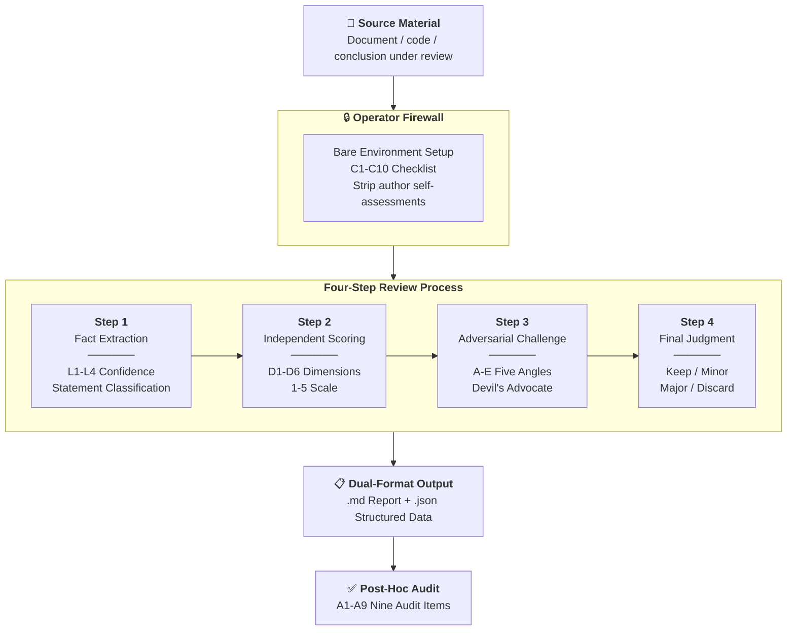

# Independent Review Toolkit · 独立审查工具包

[](https://creativecommons.org/licenses/by/4.0/)

> **English**: A field-tested protocol for multi-model review of AI-generated content. Derived from 50+ review rounds across 5 LLM backends in the [AI Collaboration Framework](https://github.com/redamancy231-create/ai-collaboration-framework) project. Includes a step-by-step SOP, copy-paste prompt templates, adversarial challenge framework, and annotated examples. **CC BY 4.0**.

[](../README.md)
[]()
[](../zh-Hant/README.md)

**Language**: Simplified Chinese (original) · [English](en/README.md) · [Traditional Chinese](zh-Hant/README.md)  
**Source**: Extracted from [AI Collaboration Project Full Lifecycle Framework](https://github.com/redamancy231-create/ai-collaboration-framework) Section 9.2 + 50+ field review rounds  
**Maturity**: The SOP core workflow has been validated across multiple backends in the source project; see the verification status below for this toolkit's own extraction and adaptation process.

> ⚡ Copy prompt → paste into new AI session → replace [material] → 5 minutes to your first independent review | 50+ rounds · 5 backends · 4-step process

> WARNING **Verification status**: The initial v2.0.1 version of this repository was extracted and adapted by a **single backend, DeepSeek-V4-Pro**. It has passed a closed independent review chain using the different backend Codex GPT-5.5:
> - **R1** (2026-07-01): final judgment Major, found 16 items (CRITICAL x3, MAJOR x10, MODERATE x2, MINOR x1) -> all fixed
> - **R2** (2026-07-01): final judgment **PASS**, 16/16 fully closed
>
> See `_reviews/` for review reports. The toolkit methodology (SOP Sections 1-12) has been validated through 50+ field rounds in the source project; the extraction, adaptation, and writing quality were confirmed by this round of different-backend review.

---

## What This Is

When you use AI to produce a document, code, or analytical conclusion, you want to know: **"Is it really sound?"**

Having the same AI check its own output = self-review (unreliable). Having an AI from a **different backend** review it in a **fully isolated** environment = independent review.

This toolkit provides a complete operating protocol so you can start your first **independent review within 5 minutes**.

### Core Beliefs

- **Independence = different backend x context isolation** (both are required)
- **Scoring must happen before challenge** (make the independent judgment first, then run adversarial validation)
- **The devil's advocate must not soften** (review is not about finding strengths; it is about finding problems)
- **Negative results are as important as positive results** ("no issue found" is also a valid conclusion)

---

## Fast Version (Start in 30 Seconds)

Copy the block below into a new AI conversation and replace `[material]` with the content you want reviewed:

```
You are an independent reviewer. Review the following material:

1. List all factual statements and mark the confidence level (verifiable/consistent/plausible/unverifiable)
2. Score it across 6 dimensions: logic/facts/method/completeness/clarity/insight (1-5)
3. Find problems from 5 angles: alternative explanations/hidden assumptions/boundary conditions/counterexamples/methodological alternatives
4. Final judgment: keep/minor revision/major revision/discard + rationale

Material: [paste here]
```

> This minimal version omits the full SOP constraints. For formal scenarios, use the [Full Review Prompt](prompts/full-review.md).

---



## Get Started in 5 Minutes

### Step 1: Understand Independence

Independent review requires two conditions at the same time:
1. **Different backend**: the AI model used by the reviewer != the AI model that produced the content
2. **Context isolation**: the reviewer cannot see the author's intermediate reasoning, self-assessment, or conclusion tendency

> "I used another agent in Claude Code to review it" -> same backend, not independent  
> "I used ChatGPT to review content produced by Claude, and opened a brand-new conversation" -> independent

### Step 2: Pick a Scenario

| Scenario | Use |
|------|--------|
| Review an AI-written methodology document | [Full Review Prompt](prompts/full-review.md) |
| Run only an adversarial challenge (stress test) | [Adversarial Challenge Prompt](prompts/adversarial.md) |
| Understand the full review workflow | [Full SOP](sop.md) |

### Step 3: Prepare the Material and Open a Brand-New Conversation

**Preparation phase** (completed by the operator):
1. Record the **author backend** (which model produced the material under review)
2. Record the **version binding** for the material under review (git commit hash / file hash / version number - at least one)
3. Prepare or choose a scoring standard (you can start with the D1-D6 six-dimensional framework in the [Full Review Prompt](prompts/full-review.md); if there is no specific rubric, use the six-dimensional framework as the default standard)

**Execution phase**:
1. Open a **brand-new conversation** (confirm that no historical context is leaked)
2. Paste only: **prompt + material under review** (do not include author self-assessment, intermediate versions, or conclusion tendency)
3. Do not tell the reviewer "who wrote this" or "where I think the problem is"
4. After collecting results, validate review quality and independence against [SOP Section 10 Post-Hoc Audit](sop.md)

---

## Directory Structure

```
independent-review-toolkit/
├── README.md                 ← You are here
├── LICENSE                   ← CC BY 4.0
├── sop.md                    ← Complete standard operating procedure for independent review
├── prompts/
│   ├── full-review.md        ← Complete four-step review prompt (fact extraction → scoring → challenge → final judgment)
│   └── adversarial.md        ← Prompt dedicated to adversarial challenge (devil's advocate mode)
└── examples/                  ← Teaching examples (reconstructed from real review findings, not verbatim transcripts)
    ├── methodology-review.md  ← Review case demonstration (complete SOP four-step workflow + annotations)
    └── methodology-review.json ← Structured JSON companion for the same case
```

---

## Field Data

This toolkit's methodology comes from the following field accumulation:

| Metric | Data |
|------|------|
| Total review rounds | 50+ |
| LLM backends involved | 5 types (GPT-5.5 / DeepSeek-V4-Pro / Kimi-K2.7 / Qwen3.7-Max / GLM-5.2) |
| CLI house | 4 (Codex / Claude / Kimi / Qwen) |
| Empirical complementarity | Same prompt, multiple backends -> blind-spot complementarity rate ~50% (validated across three backends) |
| Review decay evidence | Identified and built in anti-decay constraints |

---

## Relationship to Other Tools

| Tool | Timing | Focus |
|------|------|------|
| **This toolkit** | After the fact (after output) | "How good is it?" - complete review + adversarial challenge |
| kill-test-first | Before the fact (before starting work) | "Should this be done?" - veto-style pre-review |
| Code Review (automated) | Before/after | Code correctness/style |

## Related Projects

| Project | Relationship |
|------|------|
| [**AI Collaboration Framework**](https://github.com/redamancy231-create/ai-collaboration-framework) | **Upstream source** — The SOP in this toolkit is distilled from §9.2 of the framework + 50+ rounds of practical review |
| [**Prompt-TDD Methodology**](https://github.com/redamancy231-create/prompt-tdd-methodology) | **Sibling tool** — Both case experiments used this toolkit's independent review SOP across 17+ rounds of cross-backend review |
| [**M&A Case Study Pipeline**](https://github.com/redamancy231-create/ma-case-study-pipeline) | **Sibling project** — Eight-stage multi-model academic production pipeline; Phase 5-6 cross double-blind review is a real-world application of this toolkit's review methodology |
| [**ETF Pattern Match — pybind11**](https://github.com/redamancy231-create/etf-pattern-match-pybind11) | **Sibling project** — pybind11/C++20 accelerated quantitative strategy refactoring; used this toolkit's SOP across 4 rounds of Kimi + GPT-5.5 cross-backend review |
| [**DOCX Pipeline**](https://github.com/redamancy231-create/docx-pipeline) | **Sibling project** — Markdown → Chinese DOCX pipeline; closed after 3 rounds of GPT-5.6-Sol cross-backend independent review |
| [**Claude Skills**](https://github.com/redamancy231-create/claude-skills) | **Sibling project** — 3 battle-tested Claude Code Skills extracted from framework §9.2–§9.3, independently verified by 3 backends |

---

## License and Citation

CC BY 4.0. Please cite the version number when referencing this work.

*English translation: GPT-5.5 (via Codex CLI) · 2026-07-01*
